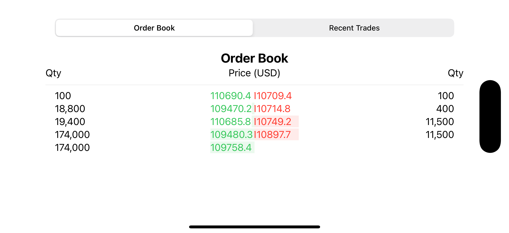
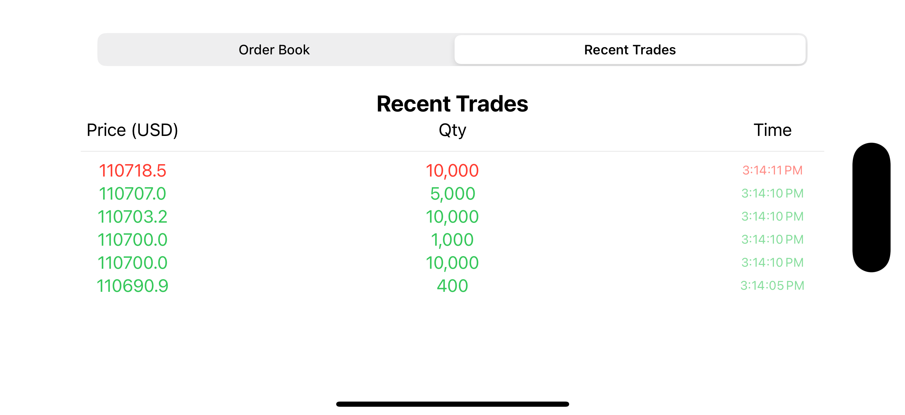

# 📈 Order Book & Recent Trades – iOS App

This project is a real-time trading interface built with **SwiftUI** and **Combine**, showcasing a live-updating **Order Book** and **Recent Trades** screen powered by **WebSocket** data from BitMEX.

---

## ✨ Features

- ✅ Real-time order book with top 20 bids and asks
- ✅ Recent trades feed with side-based color coding (buy/sell)
- ✅ Flash animation on new trades for visual clarity
- ✅ Smooth UI updates without flickering or jumpiness
- ✅ Built with SwiftUI + Combine 

---

## 📸 Screenshots

| Order Book |
|------------|
||

| Recent Trades |
|----------------|
||

---

## 🧱 Tech Stack

- **Swift 5.9+**
- **SwiftUI**
- **Combine**
- **URLSession WebSocket**
- **BitMEX WebSocket API**

---

## 🧠 Architecture Overview

- `OrderBookViewModel` and `RecentTradesViewModel` manage live data and apply diffing for efficient UI updates.
- Views are lightweight and reactive, using `@StateObject` and `@Published`.
- Row identity is managed with stable `.id` values to ensure visual stability.
- Custom animations are applied only when content changes.

---

## 🚀 Getting Started

1. Clone the repo:
   ```bash
   git clone [this repo url]
